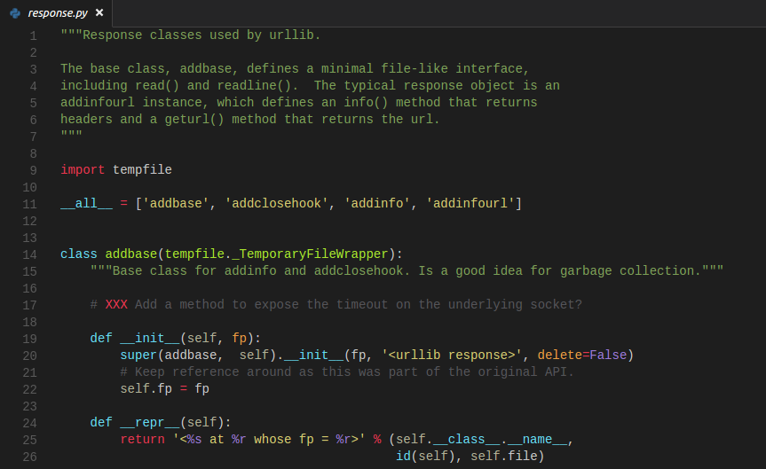

## vscode-theme-chromodynamics

This is a **slightly** modified **chromodynamics** for vscode.

Original [chromodynamics](https://github.com/MagicStack/Chromodynamics) theme only support Sublime Text and Atom,
 this theme based on that, with background color changed from black to dark.

Here is a preview with MagicPython extension installed.

You can install it from ext marketplace.

Feel free to add comments :)